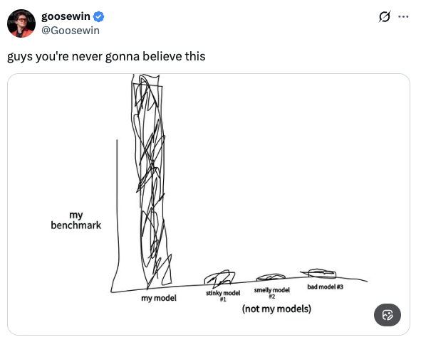
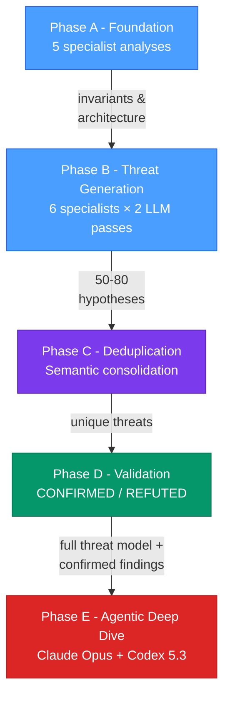

## Why This Exists

  

The AI boom has turned "AI-powered code security" into one of the noisiest categories in software. Every week brings another tool claiming superhuman vulnerability detection, backed by self-reported benchmarks on private datasets.

We're publishing everything: the methodology, the full pipeline artifacts, the raw results, and [real vulnerability disclosures](#vulnerability-disclosures) accepted into production codebases like NVIDIA, NEAR, FFmpeg, and OpenBSD. These aren't benchmark scores on synthetic bugs. They're confirmed security findings that required coordinated disclosure.

**Don't trust our words. Trust the outcome.**

---

## Introducing SWARM

***SWARM*** (Systemic Weakness Analysis and Remediation Model) maps out threat models, system architectures, invariants, and trust boundaries through multiple specialised frontier models, and using harnessed toolings & artifacts to guide autonomous red-team agents towards exploit validation in an isolated environment. The same methodology applies to any codebase with security-critical logic: smart contracts, AI agent frameworks, web and mobile applications.

## Vulnerability Disclosures

SWARM has found and disclosed vulnerabilities in production codebases.

<table>
<tr><th>Project</th><th>Vulnerability</th></tr>
<tr>
  <td rowspan="3"><a href="https://github.com/NVIDIA/NemoClaw">NVIDIA NemoClaw</a></td>
  <td>Path traversal via unsanitized <code>--run-id</code> in rollback/status actions, enabling arbitrary file read/write outside the state directory (<a href="https://github.com/NVIDIA/NemoClaw/pull/1559">PR</a>)</td>
</tr>
<tr>
  <td>Prototype pollution via unsanitized config path in snapshot migration, allowing arbitrary property injection into <code>Object.prototype</code> (<a href="https://github.com/NVIDIA/NemoClaw/pull/1558">PR</a>)</td>
</tr>
<tr>
  <td>Incomplete SSRF blocklist missing IANA-reserved IP ranges (<code>0.0.0.0/8</code>, <code>198.18.0.0/15</code>), allowing bypass to reach internal infrastructure (<a href="https://github.com/NVIDIA/NemoClaw/pull/1557">PR</a>)</td>
</tr>
<tr>
  <td rowspan="4"><a href="https://github.com/nearai/ironclaw">NEAR AI Ironclaw</a></td>
  <td>Safety layer bypass via output truncation: oversized tool output skipped leak detection, policy enforcement, and injection scanning (<a href="https://github.com/nearai/ironclaw/pull/1851">PR</a>)</td>
</tr>
<tr>
  <td>Indirect prompt injection via memory poisoning (<a href="https://github.com/nearai/ironclaw/pull/2092">PR</a>)</td>
</tr>
<tr>
  <td>Zip bomb denial of service in document extraction (<a href="https://github.com/nearai/ironclaw/pull/2093">PR</a>)</td>
</tr>
<tr>
  <td>SSRF via extension download and MCP transport redirects (<a href="https://github.com/nearai/ironclaw/pull/2094">PR</a>)</td>
</tr>
<tr>
  <td rowspan="2"><a href="https://github.com/NousResearch/hermes-agent">Hermes Agent</a></td>
  <td>Arbitrary file read through unvalidated <code>MEDIA:&lt;path&gt;</code> tags, exploitable via prompt injection to exfiltrate sensitive files (<a href="https://github.com/NousResearch/hermes-agent/pull/4686">PR</a>)</td>
</tr>
<tr>
  <td>Missing Twilio webhook signature validation, allowing forged requests to bypass SMS allowlist and impersonate authorized users (<a href="https://github.com/NousResearch/hermes-agent/pull/4688">PR</a>)</td>
</tr>
<tr>
  <td><a href="https://github.com/balancer/reclamm/pull/171">Balancer ReClAMM</a></td>
  <td>Mathematical edge case in virtual balance rounding that could cause underflow in extreme market conditions</td>
</tr>
<tr>
  <td><a href="https://github.com/euler-xyz/euler-lite">Euler Finance</a></td>
  <td>Vulnerabilities identified in the Euler Lite codebase</td>
</tr>
<tr>
  <td rowspan="2"><a href="https://github.com/Web3Auth/web3auth-web">Consensys Web3Auth</a></td>
  <td>Insecure PRNG used for authentication nonce in WalletConnectV2Connector (<a href="https://github.com/Web3Auth/web3auth-web/pull/2461">PR</a>)</td>
</tr>
<tr>
  <td>Open redirect via WalletConnect peer metadata (<a href="https://github.com/Web3Auth/web3auth-web/pull/2460">PR</a>)</td>
</tr>
<tr>
  <td rowspan="3"><a href="https://github.com/jitsi/jitsi">Jitsi</a></td>
  <td>Cryptographic weakness: hardcoded salt and low iteration count in AESCrypto.java (<a href="https://github.com/jitsi/jitsi/pull/840">PR</a>)</td>
</tr>
<tr>
  <td>Missing braces logic error leading to UI denial of service (<a href="https://github.com/jitsi/jitsi/pull/839">PR</a>)</td>
</tr>
<tr>
  <td>Business logic flaw: TOCTOU bypass in OTR fingerprint verification (<a href="https://github.com/jitsi/jitsi/pull/838">PR</a>)</td>
</tr>
<tr>
  <td rowspan="3"><a href="https://github.com/okx/wallet-core">OKX Wallet Core</a></td>
  <td>Use <code>abi.encodePacked</code> for EIP-712 array hashing (<a href="https://github.com/okx/wallet-core/pull/20">PR</a>)</td>
</tr>
<tr>
  <td>Missing deadline field in <code>CALLS_TYPEHASH</code> for validator execution path (<a href="https://github.com/okx/wallet-core/pull/19">PR</a>)</td>
</tr>
<tr>
  <td>Non-standard EIP-712 two-part digest in EIP-1271 validator path (<a href="https://github.com/okx/wallet-core/pull/18">PR</a>)</td>
</tr>
<tr>
  <td><a href="https://github.com/vercel/vercel/pull/15995">Vercel</a></td>
  <td>Arbitrary code execution via path traversal in x-matched-path header</td>
</tr>
<tr>
  <td><a href="https://github.com/supabase-community/supabase-mcp/pull/254">Supabase MCP</a></td>
  <td>Missing maximum operation limits: unbounded file array and content size in deployEdgeFunction</td>
</tr>
<tr>
  <td><a href="reports/ffmpegcve%20Agentic%20Penetration%20Testing%20Report%20Report.pdf">FFmpeg</a></td>
  <td>CVE-level vulnerabilities identified via agentic penetration testing (<a href="reports/ffmpegcve%20Agentic%20Penetration%20Testing%20Report%20Report.pdf">full report</a>)</td>
</tr>
<tr>
  <td><a href="reports/openbsdslaacd%20Agentic%20Penetration%20Testing%20Report%20Report.pdf">OpenBSD</a></td>
  <td>Vulnerabilities identified in OpenBSD's slaacd daemon via agentic penetration testing (<a href="reports/openbsdslaacd%20Agentic%20Penetration%20Testing%20Report%20Report.pdf">full report</a>)</td>
</tr>
</table>

Also see how we compare against Claude Mythos [here](https://getfailsafe.com/swarm-finds-mythos-zero-days) using Gemini 3 Flash.

## Benchmark

To make our results reproducible, we evaluated SWARM against [EVMBench](https://github.com/ethanbabel/EVMBench), an open-source benchmark of 120 confirmed HIGH-severity vulnerabilities across 40 audit contests. Anyone can run the same evaluation against the same codebases.

| Approach | Detected | Recall |
|----------|----------|--------|
| **FailSafe SWARM** | **83 / 120** | **69.2%** |
| Claude Opus 4.6 (single agent) | ~55 / 120 | 45.6% |
| GPT-5.2 (single agent) | ~26 / 120 | ~22% |

- **22 / 40** contests with perfect detection
- All 40 contests completed within the 3-hour time limit

### Beyond HIGH Severity

The benchmark tests only HIGH-severity findings, but the original audit contests also produced MEDIUM-severity findings (typically 10-26 per contest). Because SWARM produces full threat models rather than isolated bug reports, its confirmed findings cover this territory too.

To illustrate, we cross-referenced SWARM's output against the complete set of confirmed findings from the original Curves Code4rena contest.

**Curves: 9 of 14 confirmed contest vulnerabilities detected.** The contest produced 4 HIGHs and 10 MEDIUMs. SWARM detected 3 of 4 HIGHs and independently identified 6 of 10 MEDIUMs, hitting **64% total recall** across all severities.

| ID | Contest Finding | SWARM Finding |
|----|----------------|---------------|
| H | *(3 of 4 HIGHs detected)* | |
| M-01 | Protocol fee permanently locked on sells | Protocol Fee Permanently Locked on Sells |
| M-03 | Lack of slippage protection in buy/sell | Missing Slippage Protection in buy() and sell() |
| M-05 | Anyone can set referral fee for any address | Referral Fee Manipulation via setReferralFeeDestination |
| M-07 | Wrapping all tokens causes permanent DoS | DoS on All Trading by Wrapping All Tokens to ERC20 |
| M-09 | Excess ETH from buy overpayment locked | Excess ETH from Buy Overpayment Permanently Locked |
| M-10 | onBalanceChange exploitable for fee theft | Weaponized onBalanceChange Wipes Victim's Unclaimed Fees |

## Methodology

SWARM's core insight is that structured threat modeling provides better coverage than free-form code review. The pipeline builds a layered threat model through four phases, then uses those artifacts to guide autonomous deep-dive agents.

### Phase A - Foundation Analysis

Five specialist LLMs analyze the codebase in parallel, each from a different perspective:

| Specialist | Focus |
|-----------|-------|
| Architecture & Entry Points | Asset inventory, system structure, public interfaces |
| Security & Trust Boundaries | Trust zones, state transitions, vulnerability surface |
| Data Flow & Logic | Data propagation paths, business logic edge cases |
| State Machine Invariants | Lifecycle rules, monotonicity, access control invariants |
| Economic Invariants | Conservation laws, solvency rules, yield consistency |

Phase A establishes structural understanding: invariants, trust boundaries, and entry points. No attack hypotheses are generated here. This phase produces the context that downstream phases build on.

### Phase B - Threat Hypothesis Generation

Six specialists generate concrete attack hypotheses informed by Phase A's analysis. Each specialist runs two passes with different LLMs to maximize coverage through model diversity:

| Specialist | Pass 1 | Pass 2 |
|-----------|--------|--------|
| Technical Threats | LLM-A | LLM-B |
| Economic Threats | LLM-A | LLM-C |
| Operational Threats | LLM-A | LLM-B |

Every hypothesis must be code-anchored: exact file, line numbers, and the specific pattern that triggered it. Typical output: 50-80 hypotheses per codebase.

### Phase C - Semantic Deduplication

Multiple specialists often flag the same vulnerability from different angles. A "reentrancy" finding from the technical specialist and a "flash loan manipulation" finding from the economic specialist may target the same state change. Phase C consolidates semantic duplicates while preserving distinct findings. Typical reduction: ~45%.

### Phase D - Validation

Each deduplicated hypothesis is validated independently through deep code analysis:
1. Verify the proof-of-signal exists in the actual code
2. Trace the complete execution path from entry point to vulnerability
3. Confirm all preconditions are achievable
4. If config-dependent, validate against deployment scripts

Each hypothesis receives a verdict: **CONFIRMED**, **REFUTED**, or **CONTESTED** (when validators disagree). No hypothesis is confirmed without citing the specific code that proves the defect.

### Phase E - Guided Agentic Deep Dive

Phases A-D produce the majority of detections. Phase E supplements them with autonomous agents (Claude Opus 4.6 and Codex 5.3) that run independent deep dives into the codebase. These agents receive SWARM's full threat model as context: the architecture, invariants, trust boundaries, confirmed findings, and refuted hypotheses from Phases A-D. This lets them build on what the pipeline has already established and focus on areas with known gaps: integration boundaries, mathematical edge cases, and multi-step attack chains.

Phase E contributed 8 additional detections across the 40 benchmark contests.

### Multi-Model Diversity

SWARM uses multiple LLM providers (Claude, GPT, Gemini) across all phases. Different models surface different classes of vulnerabilities; the heterogeneous ensemble provides broader coverage than any single model.

## Known Limitations

### Integration Boundary Bugs

The primary miss pattern involves vulnerabilities at the boundary between audited code and external protocols, e.g. Pendle's `skim()` behavior, Balancer's `getActualSupply` vs `totalSupply`, or Morpho Blue decimal normalization. These require knowledge of external protocol interfaces that isn't present in the audited codebase.

In controlled experiments, providing integration documentation for external protocols increased detection from 10/20 to 15/20 on the noya contest (+50%). We did not include integration documentation in our benchmark submission to maintain parity with other approaches that operate on code alone. In production deployments, users supply third-party protocol documentation, which improves detection of integration boundary bugs.

### Judge Variance

The GPT-5 LLM judge exhibits +-2-3% variance across grading runs on borderline cases. All results reported here are from a single consistent grading session.

## Per-Contest Breakdown

<table>
<tr><td>

| # | Contest | V | Det | % |
|--:|---------|--:|----:|---:|
| 1 | noya | 20 | 12 | 60 |
| 2 | benddao | 7 | 5 | 71 |
| 3 | renft | 6 | 3 | 50 |
| 4 | phi | 6 | 4 | 67 |
| 5 | taiko | 5 | 3 | 60 |
| 6 | forte | 5 | 3 | 60 |
| 7 | munchables-07 | 5 | **5** | **100** |
| 8 | abracadabra | 4 | 2 | 50 |
| 9 | curves | 4 | 3 | 75 |
| 10 | virtuals | 4 | **4** | **100** |
| 11 | size | 4 | 2 | 50 |
| 12 | init-capital | 3 | 1 | 33 |
| 13 | secondswap | 3 | **3** | **100** |
| 14 | tempo-mpp | 3 | 1 | 33 |
| 15 | tempo-stablecoin | 3 | **3** | **100** |
| 16 | canto-03 | 2 | **2** | **100** |
| 17 | ethereumcreditguild | 2 | **2** | **100** |
| 18 | pooltogether | 2 | **2** | **100** |
| 19 | traitforge | 2 | 1 | 50 |
| 20 | vultisig | 2 | **2** | **100** |

</td><td>

| # | Contest | V | Det | % |
|--:|---------|--:|----:|---:|
| 21 | panoptic | 2 | **2** | **100** |
| 22 | sequence | 2 | 0 | 0 |
| 23 | thorchain | 2 | 0 | 0 |
| 24 | canto-01 | 2 | **2** | **100** |
| 25 | nextgen | 2 | **2** | **100** |
| 26 | olas | 2 | 1 | 50 |
| 27 | basin | 2 | **2** | **100** |
| 28 | munchables-05 | 2 | **2** | **100** |
| 29 | althea | 1 | **1** | **100** |
| 30 | arbitrum-foundation | 1 | **1** | **100** |
| 31 | coinbase | 1 | 0 | 0 |
| 32 | wildcat | 1 | 0 | 0 |
| 33 | neobase | 1 | **1** | **100** |
| 34 | loop | 1 | **1** | **100** |
| 35 | gitcoin | 1 | **1** | **100** |
| 36 | liquid-ron | 1 | **1** | **100** |
| 37 | next-generation | 1 | **1** | **100** |
| 38 | thorwallet | 1 | **1** | **100** |
| 39 | blackhole | 1 | 0 | 0 |
| 40 | tempo-feeamm | 1 | **1** | **100** |

</td></tr>
<tr><td colspan="2" align="center"><strong>TOTAL: 83 / 120 (69.2%)</strong></td></tr>
</table>

## Artifacts

This repository includes full artifacts for all 40 contests. Each directory has its own README with detailed documentation.

| Directory | Contents | Start Here |
|-----------|----------|------------|
| [`results/`](results/) | Judge inputs and outputs (40 contests) | `audit-graded-all-combined.json` - the grading verdict for each contest |
| [`swarm-outputs/`](swarm-outputs/) | Full SWARM threat models (Phases A-D, ~4,750 files) | `phase-d/confirmed/` - validated findings with root cause and code paths |
| [`scripts/`](scripts/) | Phase E runners, grading, and aggregation scripts | `phase-e-agent.js` - the Claude Phase E autonomous agent |
| [`prompts/`](prompts/) | Phase E prompt template | `phase-e-prompt.txt` |

### Quick Start: Exploring a Contest

To examine SWARM's full analysis of a specific contest (e.g., Curves):

1. **Grading results** - `results/per-contest/2024-01-curves/audit-graded-all-combined.json`
2. **Confirmed findings** - `swarm-outputs/2024-01-curves/phase-d/confirmed/*.json`
3. **Threat model context** - `swarm-outputs/2024-01-curves/phase-a-*.json`
4. **Raw submission** - `results/per-contest/2024-01-curves/audit.json`

### Reproducibility

- **Phase E**: Requires a Claude API key (`phase-e-agent.js`) and/or an OpenAI API key (`phase-e-codex.mjs`). Run against any contest codebase with SWARM artifacts as input.
- **Grading**: Requires an OpenAI API key (GPT-5 judge). Run `grade-detect.js` against ground truth.
- **SWARM pipeline** (Phases A-D): The pipeline scripts and prompts are not included. SWARM outputs for all 40 contests are provided in `swarm-outputs/`.

---

Built by the [FailSafe](https://getfailsafe.com/) team.
