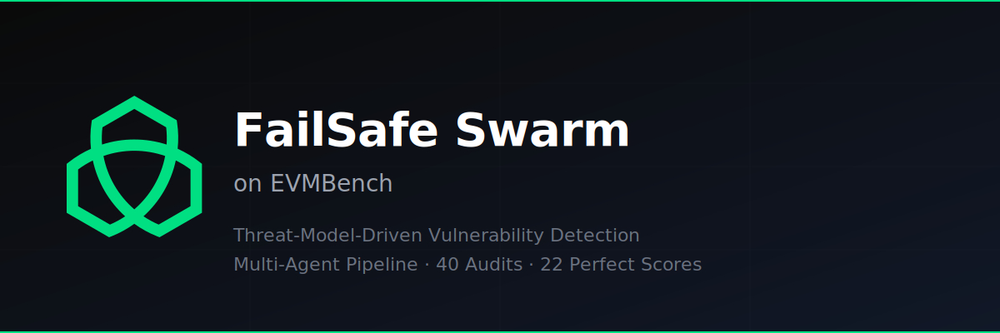
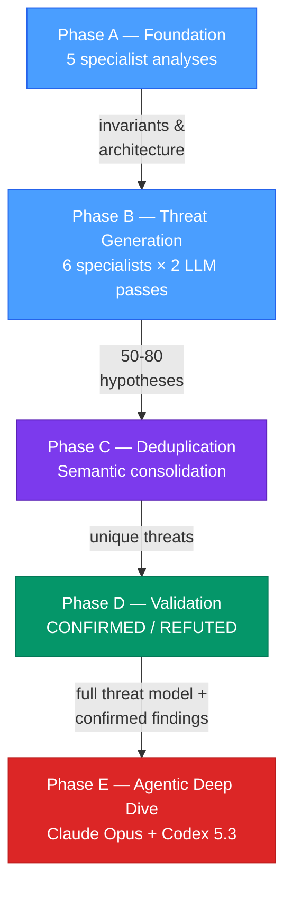

  

---

FailSafe Swarm is a multi-agent pipeline that builds structured threat models before performing targeted agentic exploration. The pipeline maps architecture, invariants, and trust boundaries through multiple specialist LLMs, then uses those artifacts to guide autonomous agents toward gaps in coverage.

## Results

### Aggregate

| Approach | Detected | Recall |
|----------|----------|--------|
| **FailSafe Swarm** | **83 / 120** | **69.2%** |
| Claude Opus 4.6 (single agent) | ~55 / 120 | 45.6% |
| GPT-5.2 (single agent) | ~26 / 120 | ~22% |

- **22 / 40** contests with perfect detection
- All 40 contests completed within EVMBench's 3-hour time limit

### Per-Contest Breakdown

<table>
<tr><td>

| # | Contest | V | Det | % |
|--:|---------|--:|----:|---:|
| 1 | noya | 20 | 12 | 60 |
| 2 | benddao | 7 | 5 | 71 |
| 3 | renft | 6 | 3 | 50 |
| 4 | phi | 6 | 4 | 67 |
| 5 | taiko | 5 | 3 | 60 |
| 6 | forte | 5 | 3 | 60 |
| 7 | munchables-07 | 5 | **5** | **100** |
| 8 | abracadabra | 4 | 2 | 50 |
| 9 | curves | 4 | 3 | 75 |
| 10 | virtuals | 4 | **4** | **100** |
| 11 | size | 4 | 2 | 50 |
| 12 | init-capital | 3 | 1 | 33 |
| 13 | secondswap | 3 | **3** | **100** |
| 14 | tempo-mpp | 3 | 1 | 33 |
| 15 | tempo-stablecoin | 3 | **3** | **100** |
| 16 | canto-03 | 2 | **2** | **100** |
| 17 | ethereumcreditguild | 2 | **2** | **100** |
| 18 | pooltogether | 2 | **2** | **100** |
| 19 | traitforge | 2 | 1 | 50 |
| 20 | vultisig | 2 | **2** | **100** |

</td><td>

| # | Contest | V | Det | % |
|--:|---------|--:|----:|---:|
| 21 | panoptic | 2 | **2** | **100** |
| 22 | sequence | 2 | 0 | 0 |
| 23 | thorchain | 2 | 0 | 0 |
| 24 | canto-01 | 2 | **2** | **100** |
| 25 | nextgen | 2 | **2** | **100** |
| 26 | olas | 2 | 1 | 50 |
| 27 | basin | 2 | **2** | **100** |
| 28 | munchables-05 | 2 | **2** | **100** |
| 29 | althea | 1 | **1** | **100** |
| 30 | arbitrum-foundation | 1 | **1** | **100** |
| 31 | coinbase | 1 | 0 | 0 |
| 32 | wildcat | 1 | 0 | 0 |
| 33 | neobase | 1 | **1** | **100** |
| 34 | loop | 1 | **1** | **100** |
| 35 | gitcoin | 1 | **1** | **100** |
| 36 | liquid-ron | 1 | **1** | **100** |
| 37 | next-generation | 1 | **1** | **100** |
| 38 | thorwallet | 1 | **1** | **100** |
| 39 | blackhole | 1 | 0 | 0 |
| 40 | tempo-feeamm | 1 | **1** | **100** |

</td></tr>
<tr><td colspan="2" align="center"><strong>TOTAL: 83 / 120 (69.2%)</strong></td></tr>
</table>

## Coverage Beyond EVMBench: Threat Model Depth

EVMBench tests detection of 120 curated HIGH-severity vulnerabilities. However, the original audit contests that sourced these codebases also produced MEDIUM-severity findings — typically 10–26 per contest — that fall outside EVMBench's scope. Because Swarm produces full threat models rather than isolated bug reports, its confirmed findings naturally extend into this territory.

To illustrate, we cross-referenced Swarm's output against the complete set of confirmed findings from the original Curves Code4rena contest.

### Curves: 9 of 14 Confirmed Contest Vulnerabilities Detected

The Curves contest produced 4 HIGHs and 10 MEDIUMs. EVMBench tests only the 4 HIGHs. Swarm detected 3 of 4 HIGHs and independently identified 6 of 10 MEDIUMs — a total of **9 out of 14 confirmed contest vulnerabilities (64%)**.

| ID | Contest Finding | Swarm Finding |
|----|----------------|---------------|
| H | *(3 of 4 HIGHs detected — graded by EVMBench)* | |
| M-01 | Protocol fee permanently locked on sells | Protocol Fee Permanently Locked on Sells |
| M-03 | Lack of slippage protection in buy/sell | Missing Slippage Protection in buy() and sell() |
| M-05 | Anyone can set referral fee for any address | Referral Fee Manipulation via setReferralFeeDestination |
| M-07 | Wrapping all tokens causes permanent DoS | DoS on All Trading by Wrapping All Tokens to ERC20 |
| M-09 | Excess ETH from buy overpayment locked | Excess ETH from Buy Overpayment Permanently Locked |
| M-10 | onBalanceChange exploitable for fee theft | Weaponized onBalanceChange Wipes Victim's Unclaimed Fees |

## What is EVMBench?

[EVMBench](https://github.com/paradigmxyz/evmbench) is a benchmark for evaluating AI agents on smart contract security, developed by OpenAI, Paradigm, and OtterSec. It comprises:

- **40 real audit codebases** spanning July 2023 through January 2026
- **120 confirmed HIGH-severity vulnerabilities** (loss-of-funds only)
- **3-hour time limit** per contest

EVMBench evaluates three capabilities: **Detect** (find vulnerabilities), **Patch** (fix them), and **Exploit** (write proof-of-concept exploits). This submission focuses on **Detect** — vulnerability discovery — which the EVMBench authors identify as the primary bottleneck: with medium-level hints, GPT-5.2 achieves 93.9% on Patch and 73.8% on Exploit, but only ~22% on unassisted Detect.

**Grading**: An LLM judge (GPT-5, high reasoning effort) determines whether the submitted audit report describes the same vulnerability as each ground truth finding. The criteria require matching root cause, code path, and remediation approach — same contract or similar impact alone is not sufficient.

## Methodology

Swarm's approach is that structured threat modeling provides better coverage than free-form code review. The pipeline builds a layered threat model through four phases, then uses those artifacts to guide autonomous deep-dive agents.

### Phase A — Foundation Analysis

Five specialist LLMs analyze the codebase in parallel, each from a different perspective:

| Specialist | Focus |
|-----------|-------|
| Architecture & Entry Points | Asset inventory, system structure, public interfaces |
| Security & Trust Boundaries | Trust zones, state transitions, vulnerability surface |
| Data Flow & Logic | Data propagation paths, business logic edge cases |
| State Machine Invariants | Lifecycle rules, monotonicity, access control invariants |
| Economic Invariants | Conservation laws, solvency rules, yield consistency |

Phase A establishes structural understanding of the protocol — its invariants, trust boundaries, and entry points. No attack hypotheses are generated; this phase produces the foundational context that downstream phases build on.

### Phase B — Threat Hypothesis Generation

Six specialists generate concrete attack hypotheses informed by Phase A's analysis. Each specialist runs two passes with different LLMs to maximize coverage through model diversity:

| Specialist | Pass 1 | Pass 2 |
|-----------|--------|--------|
| Technical Threats | LLM-A | LLM-B |
| Economic Threats | LLM-A | LLM-C |
| Operational Threats | LLM-A | LLM-B |

Every hypothesis must be code-anchored: exact file, line numbers, and the specific pattern that triggered it. Typical output: 50–80 hypotheses per codebase.

### Phase C — Semantic Deduplication

Multiple specialists often identify the same vulnerability from different angles — a "reentrancy" finding from the technical specialist and a "flash loan manipulation" finding from the economic specialist may target the same state change. Phase C consolidates semantic duplicates while preserving distinct findings. Typical reduction: ~45%.

### Phase D — Validation

Each deduplicated hypothesis is validated independently through deep code analysis:
1. Verify the proof-of-signal exists in the actual code
2. Trace the complete execution path from entry point to vulnerability
3. Confirm all preconditions are achievable
4. If config-dependent, validate against deployment scripts

Each hypothesis receives a verdict: **CONFIRMED**, **REFUTED**, or **CONTESTED** (when validators disagree). No hypothesis is confirmed without citing the specific code that proves the defect.

### Phase E — Guided Agentic Deep Dive

Phases A–D produce the majority of detections. Phase E supplements them with autonomous agents (Claude Opus 4.6 and Codex 5.3) that perform independent deep dives into the codebase. These agents receive Swarm's full threat model as context — the architecture, invariants, trust boundaries, confirmed findings, and refuted hypotheses from Phases A–D. This allows them to build on what the pipeline has already established and focus on areas where it has known gaps: integration boundaries, mathematical edge cases, and multi-step attack chains.

Phase E contributed 8 additional detections across the 40 contests.

### Multi-Model Diversity

Swarm uses multiple LLM providers (Claude, GPT, Gemini) across all phases. Different models surface different classes of vulnerabilities; the heterogeneous ensemble provides broader coverage than any single model.

## Known Limitations

### Integration Boundary Bugs

The primary miss pattern involves vulnerabilities at the boundary between audited code and external protocols — for example, Pendle's `skim()` behavior, Balancer's `getActualSupply` vs `totalSupply`, or Morpho Blue decimal normalization. These require knowledge of external protocol interfaces that is not present in the audited codebase.

In controlled experiments, providing integration documentation for external protocols increased detection from 10/20 to 15/20 on the noya contest (+50%). We did not include integration documentation in our EVMBench submission to maintain parity with other approaches that operate on code alone. In production deployments, users supply third-party protocol documentation, which measurably improves detection of integration boundary vulnerabilities.

### Judge Variance

The GPT-5 LLM judge exhibits ±2–3% variance across grading runs on borderline cases. All results reported here are from a single consistent grading session.

## Artifacts

This repository includes full artifacts for all 40 contests. Each directory has its own README with detailed documentation.

| Directory | Contents | Start Here |
|-----------|----------|------------|
| [`results/`](results/) | Judge inputs and outputs (40 contests) | `audit-graded-all-combined.json` — the grading verdict for each contest |
| [`swarm-outputs/`](swarm-outputs/) | Full Swarm threat models (Phases A–D, ~4,750 files) | `phase-d/confirmed/` — validated findings with root cause and code paths |
| [`scripts/`](scripts/) | Phase E runners, grading, and aggregation scripts | `phase-e-agent.js` — the Claude Phase E autonomous agent |
| [`prompts/`](prompts/) | Phase E prompt template | `phase-e-prompt.txt` |

### Quick Start: Exploring a Contest

To examine Swarm's full analysis of a specific contest (e.g., Curves):

1. **Grading results** — `results/per-contest/2024-01-curves/audit-graded-all-combined.json`
2. **Confirmed findings** — `swarm-outputs/2024-01-curves/phase-d/confirmed/*.json`
3. **Threat model context** — `swarm-outputs/2024-01-curves/phase-a-*.json`
4. **Raw submission** — `results/per-contest/2024-01-curves/audit.json`

### Reproducibility

- **Phase E**: Requires a Claude API key (`phase-e-agent.js`) and/or an OpenAI API key (`phase-e-codex.mjs`). Run against any EVMBench contest codebase with Swarm artifacts as input.
- **Grading**: Requires an OpenAI API key (GPT-5 judge). Run `grade-detect.js` against EVMBench ground truth.
- **Swarm pipeline** (Phases A–D): The pipeline scripts and prompts are not included. Swarm outputs for all 40 contests are provided in `swarm-outputs/`.

## Scope

EVMBench evaluates Detect, Patch, and Exploit capabilities. This submission addresses **Detect only**. Swarm's threat models include attack scenarios, affected code paths, and remediation guidance that could inform Patch and Exploit evaluation, but we have not optimized for those modes.

---

Built by the [FailSafe](https://getfailsafe.com/) team.
