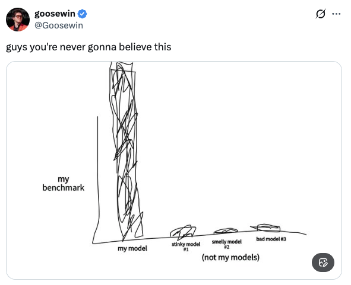
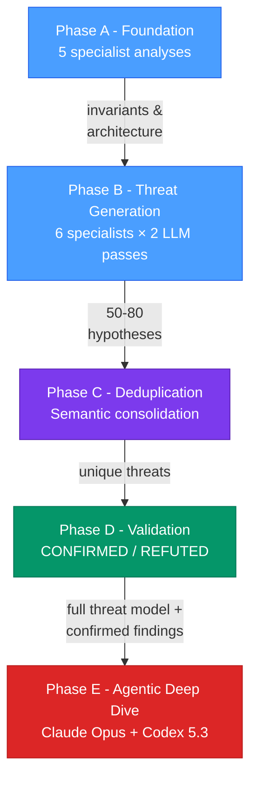

# FailSafe

  

This repository is the public record of the vulnerabilities FailSafe has discovered and disclosed in production open-source software — including NVIDIA, NEAR, FFmpeg, and OpenBSD — together with the methodology, pipeline artifacts, and benchmark results behind them.

These aren't benchmark scores on synthetic bugs. They're confirmed findings, responsibly disclosed to maintainers and — in many cases — already merged upstream.

**Don't trust our words. Trust the outcome.**

---

## Project GlassBreak

**Project GlassBreak** is FailSafe's responsible-disclosure initiative for open source. We point our platform at the open-source projects the broader ecosystem depends on, privately report the vulnerabilities we find to their maintainers, and contribute fixes back upstream — coordinating disclosure so issues are patched before they are made public. The aim is straightforward: make the software everyone builds on measurably safer, and give back to the security community rather than only benchmarking against it.

Every disclosure below was discovered by FailSafe and reported under this initiative. Status reflects the current state of each upstream report.

<table>
<tr><th>Project</th><th>Vulnerability</th><th>Status</th></tr>
<tr>
  <td rowspan="3"><a href="https://github.com/NVIDIA/NemoClaw">NVIDIA NemoClaw</a></td>
  <td>Path traversal via unsanitized <code>--run-id</code> in rollback/status actions, enabling arbitrary file read/write outside the state directory (<a href="https://github.com/NVIDIA/NemoClaw/pull/1559">PR</a>)</td>
  <td>Merged</td>
</tr>
<tr>
  <td>Prototype pollution via unsanitized config path in snapshot migration, allowing arbitrary property injection into <code>Object.prototype</code> (<a href="https://github.com/NVIDIA/NemoClaw/pull/1558">PR</a>)</td>
  <td>Merged</td>
</tr>
<tr>
  <td>Incomplete SSRF blocklist missing IANA-reserved IP ranges (<code>0.0.0.0/8</code>, <code>198.18.0.0/15</code>), allowing bypass to reach internal infrastructure (<a href="https://github.com/NVIDIA/NemoClaw/pull/1557">PR</a>)</td>
  <td>Merged</td>
</tr>
<tr>
  <td rowspan="4"><a href="https://github.com/nearai/ironclaw">NEAR AI Ironclaw</a></td>
  <td>Safety layer bypass via output truncation: oversized tool output skipped leak detection, policy enforcement, and injection scanning (<a href="https://github.com/nearai/ironclaw/pull/1851">PR</a>)</td>
  <td>Merged</td>
</tr>
<tr>
  <td>Indirect prompt injection via memory poisoning (<a href="https://github.com/nearai/ironclaw/pull/2092">PR</a>)</td>
  <td>Open</td>
</tr>
<tr>
  <td>Zip bomb denial of service in document extraction (<a href="https://github.com/nearai/ironclaw/pull/2093">PR</a>)</td>
  <td>Merged</td>
</tr>
<tr>
  <td>SSRF via extension download and MCP transport redirects (<a href="https://github.com/nearai/ironclaw/pull/2094">PR</a>)</td>
  <td>Open</td>
</tr>
<tr>
  <td rowspan="2"><a href="https://github.com/NousResearch/hermes-agent">Hermes Agent</a></td>
  <td>Arbitrary file read through unvalidated <code>MEDIA:&lt;path&gt;</code> tags, exploitable via prompt injection to exfiltrate sensitive files (<a href="https://github.com/NousResearch/hermes-agent/pull/4686">PR</a>)</td>
  <td>Superseded</td>
</tr>
<tr>
  <td>Missing Twilio webhook signature validation, allowing forged requests to bypass SMS allowlist and impersonate authorized users (<a href="https://github.com/NousResearch/hermes-agent/pull/4688">PR</a>)</td>
  <td>Superseded</td>
</tr>
<tr>
  <td><a href="https://github.com/balancer/reclamm/pull/171">Balancer ReClAMM</a></td>
  <td>Mathematical edge case in virtual balance rounding that could cause underflow in extreme market conditions</td>
  <td>Merged</td>
</tr>
<tr>
  <td><a href="https://github.com/euler-xyz/euler-lite">Euler Finance</a></td>
  <td>Vulnerabilities identified in the Euler Lite codebase</td>
  <td>Reported</td>
</tr>
<tr>
  <td rowspan="2"><a href="https://github.com/Web3Auth/web3auth-web">Consensys Web3Auth</a></td>
  <td>Insecure PRNG used for authentication nonce in WalletConnectV2Connector (<a href="https://github.com/Web3Auth/web3auth-web/pull/2461">PR</a>)</td>
  <td>Superseded</td>
</tr>
<tr>
  <td>Open redirect via WalletConnect peer metadata (<a href="https://github.com/Web3Auth/web3auth-web/pull/2460">PR</a>)</td>
  <td>Merged</td>
</tr>
<tr>
  <td rowspan="3"><a href="https://github.com/jitsi/jitsi">Jitsi</a></td>
  <td>Cryptographic weakness: hardcoded salt and low iteration count in AESCrypto.java (<a href="https://github.com/jitsi/jitsi/pull/840">PR</a>)</td>
  <td>Closed</td>
</tr>
<tr>
  <td>Missing braces logic error leading to UI denial of service (<a href="https://github.com/jitsi/jitsi/pull/839">PR</a>)</td>
  <td>Open</td>
</tr>
<tr>
  <td>Business logic flaw: TOCTOU bypass in OTR fingerprint verification (<a href="https://github.com/jitsi/jitsi/pull/838">PR</a>)</td>
  <td>Open</td>
</tr>
<tr>
  <td rowspan="3"><a href="https://github.com/okx/wallet-core">OKX Wallet Core</a></td>
  <td>Use <code>abi.encodePacked</code> for EIP-712 array hashing (<a href="https://github.com/okx/wallet-core/pull/20">PR</a>)</td>
  <td>Submitted†</td>
</tr>
<tr>
  <td>Missing deadline field in <code>CALLS_TYPEHASH</code> for validator execution path (<a href="https://github.com/okx/wallet-core/pull/19">PR</a>)</td>
  <td>Submitted†</td>
</tr>
<tr>
  <td>Non-standard EIP-712 two-part digest in EIP-1271 validator path (<a href="https://github.com/okx/wallet-core/pull/18">PR</a>)</td>
  <td>Submitted†</td>
</tr>
<tr>
  <td><a href="https://github.com/vercel/vercel/pull/15995">Vercel</a></td>
  <td>Arbitrary code execution via path traversal in x-matched-path header</td>
  <td>Open</td>
</tr>
<tr>
  <td><a href="https://github.com/supabase-community/supabase-mcp/pull/254">Supabase MCP</a></td>
  <td>Missing maximum operation limits: unbounded file array and content size in deployEdgeFunction</td>
  <td>Open</td>
</tr>
<tr>
  <td><a href="reports/ffmpegcve%20Agentic%20Penetration%20Testing%20Report%20Report.pdf">FFmpeg</a></td>
  <td>CVE-level vulnerabilities identified via agentic penetration testing (<a href="reports/ffmpegcve%20Agentic%20Penetration%20Testing%20Report%20Report.pdf">full report</a>)</td>
  <td>Reported</td>
</tr>
<tr>
  <td><a href="reports/openbsdslaacd%20Agentic%20Penetration%20Testing%20Report%20Report.pdf">OpenBSD</a></td>
  <td>Vulnerabilities identified in OpenBSD's slaacd daemon via agentic penetration testing (<a href="reports/openbsdslaacd%20Agentic%20Penetration%20Testing%20Report%20Report.pdf">full report</a>)</td>
  <td>Reported</td>
</tr>
<tr>
  <td rowspan="2"><a href="https://github.com/fim-ai/fim-one">FIM (fim-one)</a></td>
  <td>Authenticated SSRF via unvalidated MCP SSE/HTTP server URLs (no SSRF validation on create/update) (<a href="https://github.com/fim-ai/fim-one/pull/14">PR</a>)</td>
  <td>Merged</td>
</tr>
<tr>
  <td>IPv4-mapped IPv6 (<code>::ffff:0:0/96</code>) bypass in <code>is_private_ip()</code> SSRF protection (<a href="https://github.com/fim-ai/fim-one/pull/15">PR</a>)</td>
  <td>Merged</td>
</tr>
<tr>
  <td><a href="https://github.com/aegra/aegra">Aegra</a></td>
  <td>Cross-user assistant config disclosure via missing ownership check in <code>_prepare_run</code> (<a href="https://github.com/aegra/aegra/pull/424">PR</a>)</td>
  <td>Merged</td>
</tr>
<tr>
  <td rowspan="2"><a href="https://github.com/apocas/restai">RestAI</a></td>
  <td>IPv4-mapped IPv6 bypass in <code>_is_private_ip</code> SSRF protection (<a href="https://github.com/apocas/restai/pull/178">PR</a>)</td>
  <td>Merged</td>
</tr>
<tr>
  <td>SSRF protection for MCP server HTTP/HTTPS/SSE hosts (<a href="https://github.com/apocas/restai/pull/177">PR</a>)</td>
  <td>Superseded</td>
</tr>
<tr>
  <td rowspan="2"><a href="https://github.com/heymrun/heym">HeyM</a></td>
  <td>SQL injection in webhook handler via unparameterized <code>node_id</code> lookup (<a href="https://github.com/heymrun/heym/pull/131">PR</a>)</td>
  <td>Merged</td>
</tr>
<tr>
  <td>Default JWT secret accepted at startup; require a non-default <code>secret_key</code> (<a href="https://github.com/heymrun/heym/pull/130">PR</a>)</td>
  <td>Merged</td>
</tr>
<tr>
  <td><a href="https://github.com/helixml/helix">Helix</a></td>
  <td>Open-redirect phishing via logout <code>redirect_uri</code>; restrict to same-origin (<a href="https://github.com/helixml/helix/pull/2484">PR</a>)</td>
  <td>Merged</td>
</tr>
<tr>
  <td rowspan="2"><a href="https://github.com/SolaceLabs/solace-agent-mesh">Solace Agent Mesh</a></td>
  <td>Fail-open authentication: dev mode left requests <code>authenticated</code> (<a href="https://github.com/SolaceLabs/solace-agent-mesh/pull/1572">PR</a>)</td>
  <td>Open</td>
</tr>
<tr>
  <td>XSS in OAuth callback via unescaped error parameters (<a href="https://github.com/SolaceLabs/solace-agent-mesh/pull/1573">PR</a>)</td>
  <td>Open</td>
</tr>
<tr>
  <td><a href="https://github.com/Skyvern-AI/skyvern">Skyvern</a></td>
  <td>SSRF to cloud IMDS via <code>HttpRequestBlock</code> in workflow execution (<a href="https://github.com/Skyvern-AI/skyvern/pull/6537">PR</a>)</td>
  <td>Open</td>
</tr>
<tr>
  <td rowspan="2"><a href="https://github.com/Intelligent-Internet/ii-agent">ii-agent</a></td>
  <td>Unauthenticated RCE via MCP proxy: require API key auth for <code>/custom-mcp</code> endpoint (<a href="https://github.com/Intelligent-Internet/ii-agent/pull/206">PR</a>)</td>
  <td>Open</td>
</tr>
<tr>
  <td><code>eval()</code> code injection via LLM tool args in <code>UserInputField</code> (<a href="https://github.com/Intelligent-Internet/ii-agent/pull/207">PR</a>)</td>
  <td>Open</td>
</tr>
<tr>
  <td rowspan="2"><a href="https://github.com/crestalnetwork/intentkit">IntentKit</a></td>
  <td>Unauthenticated production routes exposed; gate local routes behind ENV check (<a href="https://github.com/crestalnetwork/intentkit/pull/980">PR</a>)</td>
  <td>Open</td>
</tr>
<tr>
  <td>Stored prompt injection via unauthenticated autonomous task creation (<a href="https://github.com/crestalnetwork/intentkit/pull/981">PR</a>)</td>
  <td>Open</td>
</tr>
<tr>
  <td rowspan="2"><a href="https://github.com/trypromptly/LLMStack">LLMStack</a></td>
  <td><code>or True</code> auth bypass in <code>AuthorizationMiddleware</code> (<a href="https://github.com/trypromptly/LLMStack/pull/312">PR</a>)</td>
  <td>Open</td>
</tr>
<tr>
  <td>Missing SSRF protection and disabled TLS verification in URI source (<a href="https://github.com/trypromptly/LLMStack/pull/313">PR</a>)</td>
  <td>Open</td>
</tr>
<tr>
  <td><a href="https://github.com/griptape-ai/griptape">Griptape</a></td>
  <td>Path traversal in <code>LocalFileManagerDriver</code> (absolute-path bypass + <code>..</code> sequences) (<a href="https://github.com/griptape-ai/griptape/pull/2195">PR</a>)</td>
  <td>Open</td>
</tr>
<tr>
  <td><a href="https://github.com/AgentOps-AI/agentops">AgentOps</a></td>
  <td>Reflected XSS in <code>/auth/callback</code> via unescaped <code>redirect_to</code> in JS context, enabling OAuth token theft (<a href="https://github.com/AgentOps-AI/agentops/pull/1409">PR</a>)</td>
  <td>Open</td>
</tr>
<tr>
  <td><a href="https://github.com/agentscope-ai/agentscope-runtime">AgentScope Runtime</a></td>
  <td>Missing admin auth guard on process control endpoints (<a href="https://github.com/agentscope-ai/agentscope-runtime/pull/516">PR</a>)</td>
  <td>Open</td>
</tr>
<tr>
  <td><a href="https://github.com/langflow-ai/openrag">OpenRAG</a></td>
  <td>Missing OAuth credentials silently enable anonymous authenticated access (<a href="https://github.com/langflow-ai/openrag/pull/1978">PR</a>)</td>
  <td>Open</td>
</tr>
<tr>
  <td><a href="https://github.com/IBM/mcp-context-forge">IBM MCP Context Forge</a></td>
  <td>Weak secrets accepted on exposed gateway binds (<a href="https://github.com/IBM/mcp-context-forge/pull/5358">PR</a>)</td>
  <td>Open</td>
</tr>
<tr>
  <td><a href="https://github.com/Mintplex-Labs/anything-llm">AnythingLLM</a></td>
  <td>Thread lookup not scoped to validated workspace in <code>validWorkspaceAndThreadSlug</code> (<a href="https://github.com/Mintplex-Labs/anything-llm/pull/5784">PR</a>)</td>
  <td>Open</td>
</tr>
<tr>
  <td rowspan="2"><a href="https://github.com/airweave-ai/airweave">Airweave</a></td>
  <td>Auth-disabled bootstrap without explicit local-dev opt-in (<a href="https://github.com/airweave-ai/airweave/pull/1808">PR</a>)</td>
  <td>Open</td>
</tr>
<tr>
  <td>Webhook management not gated behind privileged org role (<a href="https://github.com/airweave-ai/airweave/pull/1809">PR</a>)</td>
  <td>Open</td>
</tr>
<tr>
  <td><a href="https://github.com/themanojdesai/python-a2a">python-a2a</a></td>
  <td>Missing API key auth on mutating routes (<code>before_request</code> gate) (<a href="https://github.com/themanojdesai/python-a2a/pull/95">PR</a>)</td>
  <td>Open</td>
</tr>
<tr>
  <td><a href="https://github.com/wassim249/fastapi-langgraph-agent-production-ready-template">FastAPI LangGraph Template</a></td>
  <td>Fail-open on missing or placeholder environment secrets (<a href="https://github.com/wassim249/fastapi-langgraph-agent-production-ready-template/pull/90">PR</a>)</td>
  <td>Open</td>
</tr>
<tr>
  <td><a href="https://github.com/toeverything/AFFiNE">AFFiNE</a></td>
  <td>RevenueCat webhook handling hardening (<a href="https://github.com/toeverything/AFFiNE/pull/15152">PR</a>)</td>
  <td>Open</td>
</tr>
<tr>
  <td><a href="https://github.com/openonion/connectonion">ConnectOnion</a></td>
  <td>Missing word boundary in <code>Bash(cmd *)</code> permission wildcard (<a href="https://github.com/openonion/connectonion/pull/156">PR</a>)</td>
  <td>Open</td>
</tr>
</table>

**Status legend:** *Merged* — accepted and merged upstream. *Open* — submitted, pending maintainer review. *Superseded* — maintainer fixed the reported vulnerability independently and closed the PR (contribution acknowledged). *Closed* — closed without adoption. *Reported* — disclosed via security report; no public PR. † *Submitted* — okx/wallet-core disclosures predate the repository disabling public pull requests; the original PR links no longer resolve.

Also see how we compare against Claude Mythos [here](https://getfailsafe.com/swarm-finds-mythos-zero-days) using Gemini 3 Flash.

## The Engine: FailSafe's Agentic Offensive Security Platform

Every finding above comes from **FailSafe's Agentic Offensive Security Platform** — an autonomous system that maps out threat models, system architectures, invariants, and trust boundaries through multiple specialised frontier models, then uses harnessed tooling and artifacts to guide autonomous red-team agents toward exploit validation in an isolated environment. The same approach applies to any codebase with security-critical logic: smart contracts, AI agent frameworks, web and mobile applications.

The rest of this README documents how the platform works and how it performs.

## Benchmark

To make our results reproducible, we evaluated FailSafe against [EVMBench](https://github.com/ethanbabel/EVMBench), an open-source benchmark of 120 confirmed HIGH-severity vulnerabilities across 40 audit contests. Anyone can run the same evaluation against the same codebases.

| Approach | Detected | Recall |
|----------|----------|--------|
| **FailSafe** | **83 / 120** | **69.2%** |
| Claude Opus 4.6 (single agent) | ~55 / 120 | 45.6% |
| GPT-5.2 (single agent) | ~26 / 120 | ~22% |

- **22 / 40** contests with perfect detection
- All 40 contests completed within the 3-hour time limit

### Beyond HIGH Severity

The benchmark tests only HIGH-severity findings, but the original audit contests also produced MEDIUM-severity findings (typically 10-26 per contest). Because the platform produces full threat models rather than isolated bug reports, its confirmed findings cover this territory too.

To illustrate, we cross-referenced the platform's output against the complete set of confirmed findings from the original Curves Code4rena contest.

**Curves: 9 of 14 confirmed contest vulnerabilities detected.** The contest produced 4 HIGHs and 10 MEDIUMs. FailSafe detected 3 of 4 HIGHs and independently identified 6 of 10 MEDIUMs, hitting **64% total recall** across all severities.

| ID | Contest Finding | FailSafe Finding |
|----|----------------|---------------|
| H | *(3 of 4 HIGHs detected)* | |
| M-01 | Protocol fee permanently locked on sells | Protocol Fee Permanently Locked on Sells |
| M-03 | Lack of slippage protection in buy/sell | Missing Slippage Protection in buy() and sell() |
| M-05 | Anyone can set referral fee for any address | Referral Fee Manipulation via setReferralFeeDestination |
| M-07 | Wrapping all tokens causes permanent DoS | DoS on All Trading by Wrapping All Tokens to ERC20 |
| M-09 | Excess ETH from buy overpayment locked | Excess ETH from Buy Overpayment Permanently Locked |
| M-10 | onBalanceChange exploitable for fee theft | Weaponized onBalanceChange Wipes Victim's Unclaimed Fees |

## Methodology

The platform's core insight is that structured threat modeling provides better coverage than free-form code review. The pipeline builds a layered threat model through four phases, then uses those artifacts to guide autonomous deep-dive agents.

```mermaid
flowchart TD
    A["Phase A - Foundation<br/>5 specialist analyses"]
    B["Phase B - Threat Generation<br/>6 specialists × 2 LLM passes"]
    C["Phase C - Deduplication<br/>Semantic consolidation"]
    D["Phase D - Validation<br/>CONFIRMED / REFUTED"]
    E["Phase E - Agentic Deep Dive<br/>Claude Opus + Codex 5.3"]

    A -->|"invariants &<br/>architecture"| B
    B -->|"50-80<br/>hypotheses"| C
    C -->|"unique threats"| D
    D -->|"full threat model +<br/>confirmed findings"| E

    style A fill:#4a9eff,color:#fff,stroke:#2563eb
    style B fill:#4a9eff,color:#fff,stroke:#2563eb
    style C fill:#7c3aed,color:#fff,stroke:#5b21b6
    style D fill:#059669,color:#fff,stroke:#047857
    style E fill:#dc2626,color:#fff,stroke:#b91c1c
```

### Phase A - Foundation Analysis

Five specialist LLMs analyze the codebase in parallel, each from a different perspective:

| Specialist | Focus |
|-----------|-------|
| Architecture & Entry Points | Asset inventory, system structure, public interfaces |
| Security & Trust Boundaries | Trust zones, state transitions, vulnerability surface |
| Data Flow & Logic | Data propagation paths, business logic edge cases |
| State Machine Invariants | Lifecycle rules, monotonicity, access control invariants |
| Economic Invariants | Conservation laws, solvency rules, yield consistency |

Phase A establishes structural understanding: invariants, trust boundaries, and entry points. No attack hypotheses are generated here. This phase produces the context that downstream phases build on.

### Phase B - Threat Hypothesis Generation

Six specialists generate concrete attack hypotheses informed by Phase A's analysis. Each specialist runs two passes with different LLMs to maximize coverage through model diversity:

| Specialist | Pass 1 | Pass 2 |
|-----------|--------|--------|
| Technical Threats | LLM-A | LLM-B |
| Economic Threats | LLM-A | LLM-C |
| Operational Threats | LLM-A | LLM-B |

Every hypothesis must be code-anchored: exact file, line numbers, and the specific pattern that triggered it. Typical output: 50-80 hypotheses per codebase.

### Phase C - Semantic Deduplication

Multiple specialists often flag the same vulnerability from different angles. A "reentrancy" finding from the technical specialist and a "flash loan manipulation" finding from the economic specialist may target the same state change. Phase C consolidates semantic duplicates while preserving distinct findings. Typical reduction: ~45%.

### Phase D - Validation

Each deduplicated hypothesis is validated independently through deep code analysis:
1. Verify the proof-of-signal exists in the actual code
2. Trace the complete execution path from entry point to vulnerability
3. Confirm all preconditions are achievable
4. If config-dependent, validate against deployment scripts

Each hypothesis receives a verdict: **CONFIRMED**, **REFUTED**, or **CONTESTED** (when validators disagree). No hypothesis is confirmed without citing the specific code that proves the defect.

### Phase E - Guided Agentic Deep Dive

Phases A-D produce the majority of detections. Phase E supplements them with autonomous agents (Claude Opus 4.6 and Codex 5.3) that run independent deep dives into the codebase. These agents receive the platform's full threat model as context: the architecture, invariants, trust boundaries, confirmed findings, and refuted hypotheses from Phases A-D. This lets them build on what the pipeline has already established and focus on areas with known gaps: integration boundaries, mathematical edge cases, and multi-step attack chains.

Phase E contributed 8 additional detections across the 40 benchmark contests.

### Multi-Model Diversity

The platform uses multiple LLM providers (Claude, GPT, Gemini) across all phases. Different models surface different classes of vulnerabilities; the heterogeneous ensemble provides broader coverage than any single model.

## Known Limitations

### Integration Boundary Bugs

The primary miss pattern involves vulnerabilities at the boundary between audited code and external protocols, e.g. Pendle's `skim()` behavior, Balancer's `getActualSupply` vs `totalSupply`, or Morpho Blue decimal normalization. These require knowledge of external protocol interfaces that isn't present in the audited codebase.

In controlled experiments, providing integration documentation for external protocols increased detection from 10/20 to 15/20 on the noya contest (+50%). We did not include integration documentation in our benchmark submission to maintain parity with other approaches that operate on code alone. In production deployments, users supply third-party protocol documentation, which improves detection of integration boundary bugs.

### Judge Variance

The GPT-5 LLM judge exhibits +-2-3% variance across grading runs on borderline cases. All results reported here are from a single consistent grading session.

## Per-Contest Breakdown

<table>
<tr><td>

| # | Contest | V | Det | % |
|--:|---------|--:|----:|---:|
| 1 | noya | 20 | 12 | 60 |
| 2 | benddao | 7 | 5 | 71 |
| 3 | renft | 6 | 3 | 50 |
| 4 | phi | 6 | 4 | 67 |
| 5 | taiko | 5 | 3 | 60 |
| 6 | forte | 5 | 3 | 60 |
| 7 | munchables-07 | 5 | **5** | **100** |
| 8 | abracadabra | 4 | 2 | 50 |
| 9 | curves | 4 | 3 | 75 |
| 10 | virtuals | 4 | **4** | **100** |
| 11 | size | 4 | 2 | 50 |
| 12 | init-capital | 3 | 1 | 33 |
| 13 | secondswap | 3 | **3** | **100** |
| 14 | tempo-mpp | 3 | 1 | 33 |
| 15 | tempo-stablecoin | 3 | **3** | **100** |
| 16 | canto-03 | 2 | **2** | **100** |
| 17 | ethereumcreditguild | 2 | **2** | **100** |
| 18 | pooltogether | 2 | **2** | **100** |
| 19 | traitforge | 2 | 1 | 50 |
| 20 | vultisig | 2 | **2** | **100** |

</td><td>

| # | Contest | V | Det | % |
|--:|---------|--:|----:|---:|
| 21 | panoptic | 2 | **2** | **100** |
| 22 | sequence | 2 | 0 | 0 |
| 23 | thorchain | 2 | 0 | 0 |
| 24 | canto-01 | 2 | **2** | **100** |
| 25 | nextgen | 2 | **2** | **100** |
| 26 | olas | 2 | 1 | 50 |
| 27 | basin | 2 | **2** | **100** |
| 28 | munchables-05 | 2 | **2** | **100** |
| 29 | althea | 1 | **1** | **100** |
| 30 | arbitrum-foundation | 1 | **1** | **100** |
| 31 | coinbase | 1 | 0 | 0 |
| 32 | wildcat | 1 | 0 | 0 |
| 33 | neobase | 1 | **1** | **100** |
| 34 | loop | 1 | **1** | **100** |
| 35 | gitcoin | 1 | **1** | **100** |
| 36 | liquid-ron | 1 | **1** | **100** |
| 37 | next-generation | 1 | **1** | **100** |
| 38 | thorwallet | 1 | **1** | **100** |
| 39 | blackhole | 1 | 0 | 0 |
| 40 | tempo-feeamm | 1 | **1** | **100** |

</td></tr>
<tr><td colspan="2" align="center"><strong>TOTAL: 83 / 120 (69.2%)</strong></td></tr>
</table>

## Artifacts

This repository includes full artifacts for all 40 contests. Each directory has its own README with detailed documentation.

| Directory | Contents | Start Here |
|-----------|----------|------------|
| [`results/`](results/) | Judge inputs and outputs (40 contests) | `audit-graded-all-combined.json` - the grading verdict for each contest |
| [`swarm-outputs/`](swarm-outputs/) | Full threat models (Phases A-D, ~4,750 files) | `phase-d/confirmed/` - validated findings with root cause and code paths |
| [`scripts/`](scripts/) | Phase E runners, grading, and aggregation scripts | `phase-e-agent.js` - the Claude Phase E autonomous agent |
| [`prompts/`](prompts/) | Phase E prompt template | `phase-e-prompt.txt` |

### Quick Start: Exploring a Contest

To examine the platform's full analysis of a specific contest (e.g., Curves):

1. **Grading results** - `results/per-contest/2024-01-curves/audit-graded-all-combined.json`
2. **Confirmed findings** - `swarm-outputs/2024-01-curves/phase-d/confirmed/*.json`
3. **Threat model context** - `swarm-outputs/2024-01-curves/phase-a-*.json`
4. **Raw submission** - `results/per-contest/2024-01-curves/audit.json`

### Reproducibility

- **Phase E**: Requires a Claude API key (`phase-e-agent.js`) and/or an OpenAI API key (`phase-e-codex.mjs`). Run against any contest codebase with the platform's artifacts as input.
- **Grading**: Requires an OpenAI API key (GPT-5 judge). Run `grade-detect.js` against ground truth.
- **Pipeline** (Phases A-D): The pipeline scripts and prompts are not included. Outputs for all 40 contests are provided in `swarm-outputs/`.

---

Built by the [FailSafe](https://getfailsafe.com/) team.
